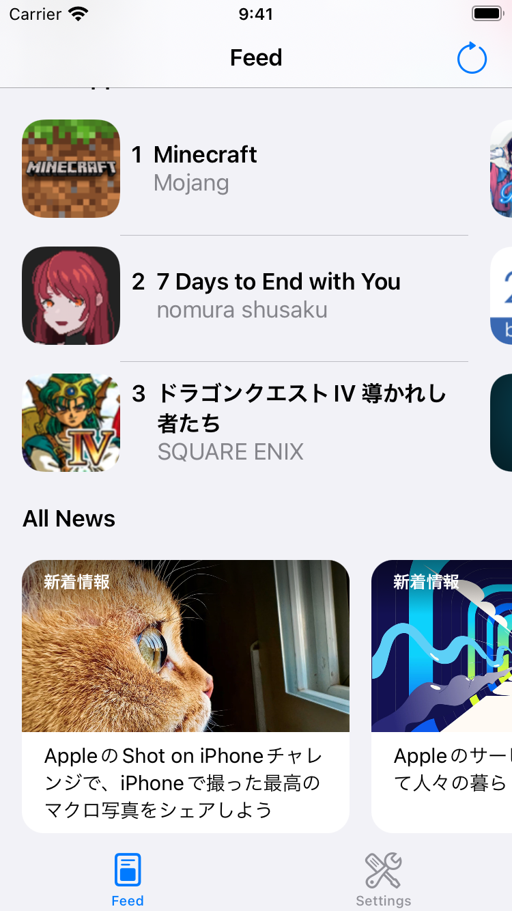

SwiftUI + FlowController Pattern
===

This is a Proof-of-Concept app for the iOS app architecture "SwiftUI + FlowController Pattern".

## Concept


There are only two points in this architecture.

- SwiftUI only be used in view layout
- View transition based on [FlowController](https://github.com/onmyway133/blog/issues/106)

We get relief from the workaround of SwiftUI such as hidden `NavigationLink` and nested `sheet` modifiers.

SwiftUI + FlowController Pattern is a UIKit-based architecture. This means that we can fallback to UIKit in any case and introduce SwiftUI safely. 

## Architecture around the views

### Data flow

This PoC app uses MVVM (also be able to use another one such as MVP).

The ViewModel implementation is the one typically used in SwiftUI and adopt `ObservableObject`. This will allow that the view layout using SwiftUI View to be implemented in the usual way.

It is passing data using `Combine` via ViewModel between SwiftUI View and FlowController.


Because of the difficulty in mocking the `@Published` property, the ViewModel provides `AnyPublisher` for access from FlowController. If no need to mock, you can use directly the `projectedValue` of `@Published` property.


```swift
public class WalkthroughSettingsViewModel: ObservableObject {
  @Published var feedLanguage: FeedLanguage = .english
  @Published var userName = ""

  var feedLanguageStream: AnyPublisher<FeedLanguage, Never> {
    $feedLanguage.eraseToAnyPublisher()
  }
  var userNameStream: AnyPublisher<String, Never> {
    $userName.eraseToAnyPublisher()
  }
}
```

### Event flow

In original FlowController, it is proposed that uses `UIResponder` for passing events from SwiftUI View to FlowController.

In this PoC app, using ViewModel to handle events. ViewModel has a `PassthroughSubject` or `CurrentValueSubject` and passing events as a reactive stream via these.


```swift
public class ModalTransitionTestViewModel: ObservableObject {
  private let _navigationSubject = PassthroughSubject<Navigation, Never>()
  var navigationSignal: AnyPublisher<Navigation, Never> {
    _navigationSubject.eraseToAnyPublisher()
  }

  func navigate(_ navigation: Navigation) {
    _navigationSubject.send(navigation)
  }
}

public struct ModalTransitionTestView: View {
  @ObservedObject private(set) var viewModel: ModalTransitionTestViewModel

  public var body: some View {
    VStack {
      Button {
        viewModel.navigate(.alert)
      } label: {
        Text("Alert")
      }
      .padding()

      Button {
        viewModel.navigate(.fullScreen)
      } label: {
        Text("Modal .fullScreen")
      }
      .padding()

      Button {
        viewModel.navigate(.pageSheet)
      } label: {
        Text("Modal .pageSheet")
      }
      .padding()
    }
  }
}

public final class ModalTransitionTestFlowController: UIHostingController<ModalTransitionTestView> {
  private var _cancellable = Set<AnyCancellable>()
  private var _viewModel: ModalTransitionTestViewModel {
    rootView.viewModel
  }

  public func start() {
    _cancellable = Set()

    _viewModel.navigationSignal
      .receive(on: DispatchQueue.main)
      .sink { [weak self] navigation in
        guard let self = self else { return }

        switch navigation {
        case .alert:
          self._showNoticeAlertView()

        case .fullScreen:
          self._showFullScreenModalView()

        case .pageSheet:
          self._showPageSheetModalView()
        }
      }
      .store(in: &_cancellable)
  }
}
```

### View transition

1. Instantiate the destination FlowController
2. Transitioning the FlowController with UIKit
    - such as `pushViewController(_:animated:)`, `present(_:animated:completion:)`, and `UINavigationController.viewContollers`
3. Start the destination FlowController

```swift
public final class FeedFlowController: UIViewController, FeedListFlowControllerDelegate {
  private let _appSalesProvider: () -> AppSalesFlowControllerService
  private let _embeddedNavigationController = UINavigationController()

  public func feedListFlowController(_: FeedListFlowControllerService, didSelect appSales: AppSegment) {
    let sales = _appSalesProvider()

    _embeddedNavigationController.pushViewController(sales, animated: true)

    sales.start(segment: appSales)
  }
}
```

This is almost the same as the original FlowController.

### Passing data between FlowControllers

To passing data between FlowControllers, these approaches are suggested that delegate pattern and uses closure as callback in original FlowController proposal.

This PoC app adopts the delegate pattern.


```swift
public final class SettingsFlowController: UIViewController, SettingsMenuFlowControllerDelegate {
  public func start() {
    let menu = _settingsMenuProvider()
    menu.delegate = self

    _embeddedNavigationController.setViewControllers([menu], animated: false)

    menu.start()
  }

  public func settingsMenuFlowController(_: SettingsMenuFlowControllerService, didSelect menuRow: SettingsMenu.Row) {
    switch menuRow {
    case .userNameSetting:
      _showUserNameSettingView()

    case .feedLanguageSetting:
      _showFeedLanguageSettingView()

    case .keyboardTest:
      _showKeyboardTestView()

    case .toolbarTest:
      _showToolbarTestView()

    case .pushTransitionTest:
      _showPushTransitionTestView()

    case .modalTransitionTest:
      _showModalTransitionTestView()

    case .licenses:
      _showLicensesView()

    default:
      break
    }
  }
}

public final class SettingsMenuFlowController: UIHostingController<SettingsMenuView> {
  public func start() {
    _cancellable = Set()

    _viewModel.navigationSignal
      .receive(on: DispatchQueue.main)
      .sink { [weak self] navigation in
        guard let self = self else { return }

        switch navigation {
        case let .menu(row):
          self.delegate?.settingsMenuFlowController(self, didSelect: row)
        }
      }
      .store(in: &_cancellable)
  }
}
```

## App features
### Walkthrough

<p>


</p>

Make a walkthrough views for the following purposes.
 
- A test for `UIPageViewController`
- Switch the global state of views by persistent data

### Feed of Apple Newsroom and App sales ranking

<p>




</p>

The feed viewer of [Apple Newsroom](https://www.apple.com/jp/newsroom/) and AppStore sales ranking.

Feed sources are below:

- [Apple Newsroom](https://www.apple.com/newsroom/rss-feed.rss)
- [Free App Ranking](https://itunes.apple.com/rss/topfreeapplications/limit=15/xml)
- [Paid App Ranking](https://itunes.apple.com/rss/toppaidapplications/limit=15/xml)

This is intended for implementing app typical features to check its feasibility.

### Settings

<p>


</p>

Manage and persist feed language setting and user name data.

The feed language setting is used in switching feed sources. The user name is a dummy to test the implementation of the persistence feature.

<p>

</p>

Licenses view is built with UIKit and [MarkdownView](https://github.com/keitaoouchi/MarkdownView.git).

### Test for some features

<p>


</p>

The views for testing app behavior.
Testable features are below:

- Keyboard with `TextField` (`UITextField`)
- Toolbar in `NavigationView` (`UINavigationController`)
- Push transition
- Modal transition

## Build
### Environment

- Xcode 13.2.1 (13C100)

### Step

```sh
$ git clone git@github.com:hugehoge/swiftui-flowcontroller-pattern
$ cd swiftui-flowcontroller-pattern
$ make bootstrap
$ make open
# Choose App scheme and run in Xcode 
```

## References

- [Coordinator and FlowController](https://github.com/onmyway133/blog/issues/106) by [@onmyway133](https://github.com/onmyway133)